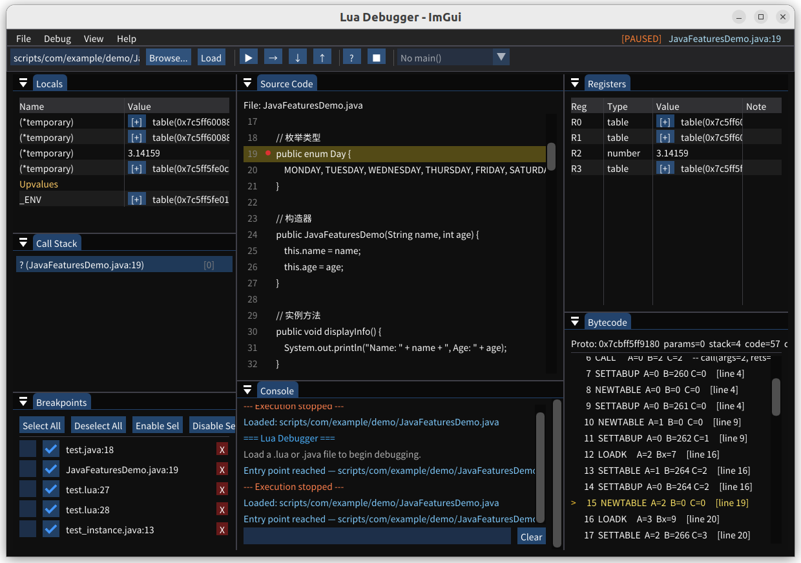

# Luja（芦葭） — Compile Java into Lua Bytecode

A compiler that translates Java source code (`.java`) directly into Lua 5.3.6 VM bytecode and executes it on an embedded Lua virtual machine. It includes a hand-written recursive-descent Java parser, reuses the Lua 5.3.6 code-generation backend, and provides a Java standard library runtime implemented in C.

A graphical **ImGui-based Lua debugger** (breakpoints, step-over/into, variable inspection) is also included.

---

## Features

- **Java → Lua bytecode compilation** — parse `.java` files and emit Lua VM instructions directly (no intermediate IR).
- **Recursive-descent parser** — hand-written in C (70 KB), no parser generator required.
- **Rich Java subset** — classes, methods, constructors, inheritance (`this`), static members, arrays, enums, exceptions (`try/catch/finally`), imports, packages, control flow, varargs, and more.
- **Java standard library in C** — `System.out.println`, `ArrayList<T>`, `HashMap<K,V>`, `StringBuilder`, `Math`, primitive wrappers (`Integer`, `Float`, `Boolean`), `String.valueOf`, etc.
- **Graphical debugger** — ImGui + GLFW + OpenGL3 debugger with breakpoints, step-over/into, variable watch, and call-stack inspection.
- **Embedded Lua 5.3.6** — full Lua language is also available side-by-side with Java compilation.

---

## How It Works

```
  .java source
       │
       ▼
  ┌─────────────┐
  │  jlex.c      │  Java lexer — tokenizes Java source
  └──────┬───────┘
         │ token stream
         ▼
  ┌─────────────┐
  │  jparser.c   │  Recursive-descent parser —
  └──────┬───────┘  builds AST and calls lcode.c APIs
         │           to emit Lua bytecode
         ▼
  ┌─────────────┐
  │  lcode.c     │  Lua code generator (from Lua 5.3.6)
  └──────┬───────┘
         │ Lua bytecode (LClosure / Proto)
         ▼
  ┌─────────────┐
  │  lvm.c       │  Lua VM executes the bytecode
  └─────────────┘
```

- `luaL_loadjava(L, filename)` → `luaL_loadfilex(L, f, "j")` — tells the loader to use the Java parser.
- In `ldo.c`, when the mode contains `'j'`, `javaY_parser()` is invoked instead of the Lua parser.
- `javaY_parser()` initializes a `JLexState` + `FuncState`, parses the full Java source, and produces a `LClosure*` ready for execution.
- `jlib.c` registers all Java standard library APIs (`System`, `ArrayList`, `HashMap`, …) into the Lua global environment so compiled Java code can call them.

---

## Build

### Prerequisites

- CMake >= 3.10
- GCC or Clang with C11/C++17 support
- GLFW3, OpenGL (`libgl1-mesa-dev`), and `pkg-config` (for the GUI debugger)

Install on Ubuntu/Debian:
```bash
sudo apt install cmake g++ libglfw3-dev libgl1-mesa-dev pkg-config
```

### Build Commands

```bash
mkdir build && cd build
cmake ..
make
```

### Build Targets

| Target | Description |
|--------|-------------|
| `lua_source` (static lib) | Lua 5.3.6 core + Java compiler + Java runtime library |
| `lua_test` | CLI test runner — loads `.java` or `.lua` files and executes them |
| `lua_dbg` | ImGui-based graphical debugger (GLFW + OpenGL3) |

---

## Usage

### CLI — Run a Java File

```bash
# Run the built-in test suite
./build/lua_test

# Run a specific Java file
./build/lua_test scripts/tests/01_basic_types.java

# Run with bytecode dump
./build/lua_test -d scripts/tests/01_basic_types.java

# Run all tests
./run_tests.sh
```

### GUI Debugger

Launch the graphical debugger separately (requires a display server):
```bash
./build/lua_dbg
```

Load a Java or Lua file, set breakpoints, step through code, and inspect variables in the GUI.



---

## Supported Java Features

| Category | Features |
|----------|----------|
| **Primitive types** | `int`, `double`, `boolean`, `char`, `String`, `null` |
| **Literals** | integer, float, string, char, hex (`0xFF`), boolean |
| **Operators** | `+` `-` `*` `/` `%`, `==` `!=` `<` `>` `<=` `>=`, `&&` `\|\|` `!`, unary `-` |
| **Compound assign** | `+=` `-=` `*=` `/=` `%=` |
| **Increment/decrement** | `++` `--` |
| **Control flow** | `if` / `else if` / `else`, `switch` / `case` / `default` / `break` |
| **Loops** | `for`, `while`, `do-while` |
| **Arrays** | declaration, literal init (`{1,2,3}`), indexed read/write |
| **Enums** | `enum` declaration and member access |
| **Classes** | `class`, `new`, constructor, `this`, instance fields/methods, static fields/methods |
| **Method overloading** | basic support (last definition wins) |
| **Varargs** | `int... args`, `String... strings` |
| **Exception handling** | `try` / `catch` / `finally`, `throw`, `throws` |
| **Imports** | single-class `import`, wildcard `import java.util.*` |
| **Packages** | `package` declaration |
| **Access modifiers** | `public`, `private`, `protected`, `static`, `final` |
| **Standard library** | `System.out.println/print`, `Integer`, `Float`, `Boolean`, `String.valueOf`, `ArrayList<T>`, `HashMap<K,V>`, `StringBuilder`, `Math.floor/ceil/abs/max`, etc. |
| **Inter-class calls** | cross-class calls via import |
| **Recursion** | static recursive methods |

---

## Project Structure

```
lua+java/
├── CMakeLists.txt              # Build configuration
├── run_tests.sh                # Batch test runner (24+ test files)
├── src/
│   ├── main.c                  # CLI entry point
│   └── dbg_main.cpp            # ImGui graphical debugger
├── lua-5.3.6/src/
│   ├── jlex.c / jlex.h         # Java lexer
│   ├── jparser.c / jparser.h   # Java recursive-descent parser (core compiler)
│   ├── jlib.c / jlib.h         # Java runtime library (C implementation)
│   ├── ldo.c                   # (patched) dispatch to Java parser when mode='j'
│   └── lauxlib.h               # (patched) luaL_loadjava macro
├── scripts/
│   ├── tests/                  # Unit tests (01_basic_types.java ~ 24_array_index.java)
│   └── test*.java              # Integration tests
├── demo/
│   ├── ComprehensiveDemo.java  # Full-feature demo
│   ├── DemoPerson.java         # Helper class (package: demo)
│   └── DemoUtils.java          # Helper class (static methods, varargs)
├── com/example/
│   └── MathUtils.java          # Importable custom class
└── third_party/imgui/          # ImGui library source
```

---

## Key Source Files

| File | Size | Description |
|------|------|-------------|
| `lua-5.3.6/src/jlex.c` | 12 KB | Java lexer — tokenizes Java source into a token stream |
| `lua-5.3.6/src/jlex.h` | 2 KB | Token definitions (keywords, operators, Token struct) |
| `lua-5.3.6/src/jparser.c` | 70 KB | Java recursive-descent parser — maps Java AST to Lua bytecode |
| `lua-5.3.6/src/jlib.c` | 17 KB | Java runtime library — C implementations of `System.out`, `ArrayList`, `HashMap`, `StringBuilder`, `Math`, etc. |
| `src/main.c` | 7.5 KB | CLI test harness |
| `src/dbg_main.cpp` | 3.2K lines | ImGui graphical debugger |

---

## Dependencies

| Dependency | Purpose |
|------------|---------|
| Lua 5.3.6 | VM core (source embedded in `lua-5.3.6/`) |
| GLFW3 | Window management for GUI debugger |
| OpenGL | Rendering for GUI debugger |
| ImGui | Immediate-mode GUI (bundled in `third_party/imgui/`) |
| libm | Math functions (`ceil`, `trunc`, …) |
| libdl | Dynamic loading (Lua's `loadlib`) |

---

## License

This project includes Lua 5.3.6 and ImGui, which are distributed under their respective licenses (MIT for Lua 5.3.6, MIT for ImGui).
